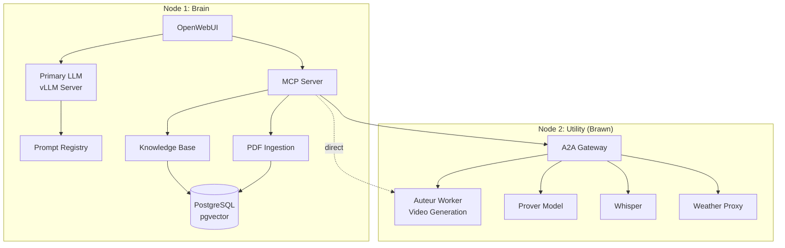
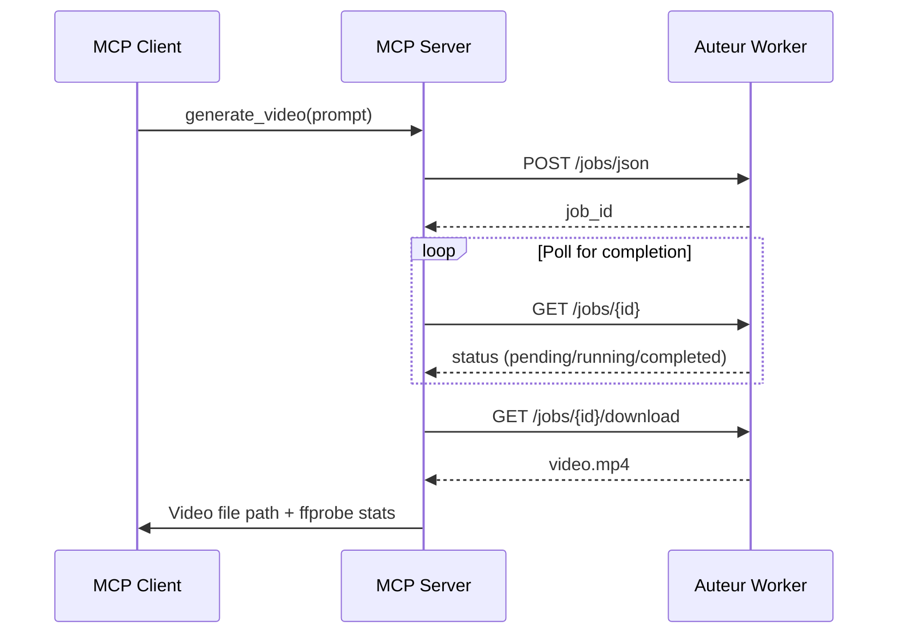
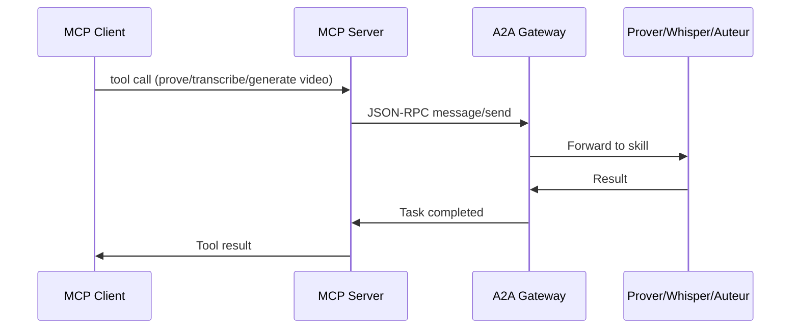

# Cluster Architecture

## Overview

The Spark Cluster follows a "Brain & Brawn" architecture pattern, distributing AI workloads across multiple nodes for optimal resource utilization:

- **Brain Node**: Orchestration, logic, and user interfaces
- **Utility Node**: Heavy compute workloads (video generation, reasoning, transcription)

## Architecture Diagram

## Service Ports

### Brain Node (Node 1)

| Service | Port | Protocol | Description |
|---------|------|----------|-------------|
| Primary LLM | 8000 | HTTP/OpenAI | Main chat/completion API |
| Prompt Registry | 8010 | HTTP/REST | Agent prompt management |
| MCP Server | 5050 | HTTP/MCP | Model Context Protocol |
| Knowledge Base | 8002 | HTTP/REST | Semantic search |
| PDF Ingestion | 8001 | HTTP/REST | Document processing |
| PostgreSQL | 5433 | PostgreSQL | Vector database |
| OpenWebUI | 8080 | HTTP | Web interface |

### Utility Node (Node 2)

| Service | Port | Protocol | Description |
|---------|------|----------|-------------|
| Auteur Worker | 8000 | HTTP/REST | AI Video Generation (HunyuanVideo, SVD) |
| Prover | 8005 | HTTP/OpenAI | Math/logic reasoning |
| Whisper | 8007 | HTTP/REST | Speech-to-text |
| Weather Proxy | 8008 | HTTP/REST | Weather forecasting |
| A2A Gateway | 9000 | HTTP/JSON-RPC | Agent-to-Agent hub |

## Data Flow

### Chat Request Flow

1. User sends message via OpenWebUI
2. OpenWebUI forwards to Primary LLM
3. LLM processes with optional tool calls via MCP
4. MCP routes tool calls to appropriate backend:
   - Local tools (KB, PDF)
   - Remote tools via A2A Gateway (Prover, Whisper, Auteur)
   - Direct video generation via Auteur Worker
5. Results aggregated and returned to user

### Video Generation Flow

### A2A Protocol Flow

## Resource Allocation

### Recommended GPU Memory Split

| Node | Service | GPU Memory | Notes |
|------|---------|-----------|-------|
| Brain | Primary LLM | 80-85% | Main orchestration |
| Brain | Prompt Registry | CPU only | |
| Utility | Auteur Worker | 30-50% | HunyuanVideo ~36GB, SVD ~8GB |
| Utility | Prover | 30-40% | Can share with Auteur (not concurrent) |
| Utility | Whisper | 20-30% | Lightweight |
| Utility | Other services | CPU only | |

> **Note**: On GB10 with unified memory (128GB), Auteur Worker typically uses ~30GB peak RSS while keeping models in fast path. The `no_offload=True` setting avoids CPU offload overhead on unified memory systems.

### Scaling Considerations

- **Vertical**: Increase `GPU_MEM_UTIL` for larger models
- **Horizontal**: Add more Utility nodes for specialized tasks
- **Context Length**: Adjust `MAX_MODEL_LEN` based on GPU memory
- **Video Generation**: Single worker per node (serialized queue for OOM prevention)

## Network Requirements

- Low-latency connection between nodes (< 1ms preferred)
- Ports must be accessible between nodes
- Optional: RDMA for high-throughput scenarios

## Security Considerations

- Services bind to 0.0.0.0 by default (configure firewall)
- No authentication built-in (add reverse proxy for production)
- Sensitive data should be encrypted at rest
